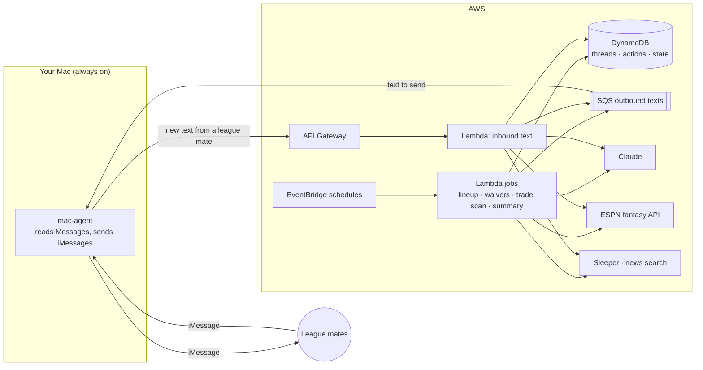
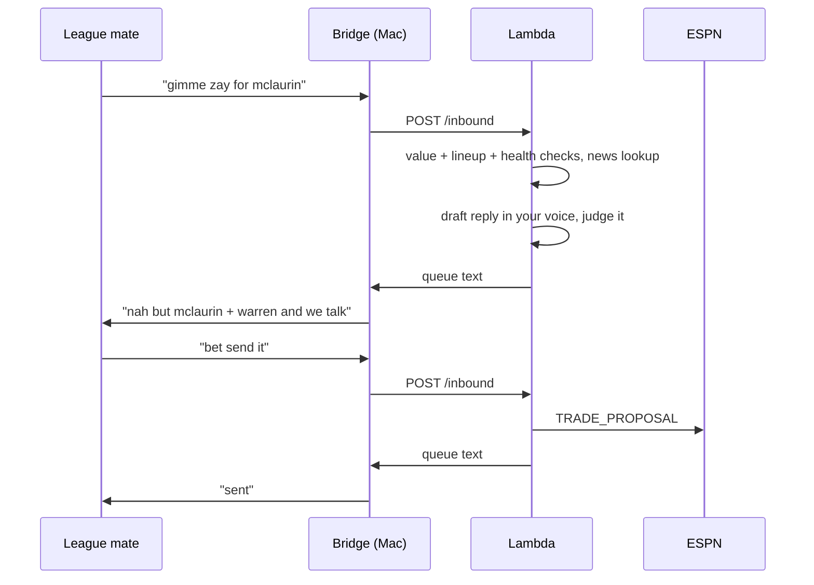

# AI Fantasy Manager

An autonomous manager for your ESPN fantasy football team. It sets your lineup, works the waiver wire, hunts for trades, and negotiates them with your league mates over iMessage, in your own texting voice.

It runs 24/7 on AWS. Your Mac only bridges iMessage.



## What it does

| Job | When | What |
|---|---|---|
| Lineup | Thu 6pm, Sun 10am & 3pm, Mon 6pm | Optimal starters from projections, injury news, start/sit calls on questionable players |
| Waivers | Tue 9pm | Claims and free-agent adds within your drop and FAAB limits |
| Trade scan | daily 10am | Finds deals that raise your starting lineup, texts the best ones, proposes the rest on ESPN silently, reviews incoming offers |
| Inbound | on every text | Replies to league mates, negotiates, counters, accepts, submits on ESPN |
| Summary | 9am | Texts you everything it did in the last 24h |

Times are in your league's timezone. Everything is logged.

## How a negotiation works



Every offer, counter, and acceptance goes through the same hard checks before anything is sent. The model decides *what* to say; the code decides *whether* it's allowed.

## Your voice

One-time, on the Mac: export your own texts from Messages (anonymized, never leaves your machine except as a style summary), build a profile of how you write, and keep ~75 real examples as few-shots. Every outgoing text is drafted against that profile, then judged by a second model call for "would this person have written this?" and for clarity, with hard limits on length and a banned-word list you control.

## Setup

Requirements: Node 22+, an AWS account, an ESPN league, a Mac that stays awake and signed into iMessage.

```bash
git clone https://github.com/AkhilBod/ai-fantasy-manager && cd ai-fantasy-manager
npm install
cp config/league.example.json config/league.json   # your league id, team id, league mates' names + numbers
cp config/rules.example.json config/rules.json     # optional: tune the rules below
cp .env.example .env                                # ESPN cookies, API key
```

ESPN cookies: log in at fantasy.espn.com, DevTools → Application → Cookies → copy `espn_s2` and `SWID` into `.env`.

Dry-run everything locally (nothing is sent or submitted while `DRY_RUN=1`):

```bash
npm run espn:smoke     # prints your roster: confirms cookies + team id
npm run lineup
npm run waivers
npm run trades
```

Build your voice profile (Mac, needs Full Disk Access for your terminal):

```bash
npm run export -w @ffm/mac-agent   # writes data/messages-export.json
npm run voice:build                # writes data/voice-profile.json + prints sample texts
```

Deploy:

```bash
aws login
cd packages/infra && npx cdk bootstrap && npx cdk deploy
aws s3 cp ../../data/voice-profile.json s3://<ProfileBucketName>/voice-profile.json
```

Put `ESPN_S2`, `ESPN_SWID` and `ANTHROPIC_API_KEY` into the `ffm/secrets` secret (or grant Bedrock model access and skip the key). Copy the stack outputs into `.env`, then start the bridge:

```bash
npm run mac-agent
```

`packages/mac-agent/launchd.plist` has the commands to run it as a background service that survives reboots.

## Going live

Set `DRY_RUN=0` in `.env` and redeploy with `DRY_RUN=0`. Suggested order: lineup first, then waivers, then trades with one trusted league mate (`trustedFirst` in league.json), then everyone.

Text yourself **STOP** to pause everything, **GO** to resume.

## Rules (config/rules.json)

All of these are enforced in code. Change the numbers to taste; the shipped defaults are conservative.

**Trades**

| Key | Default | Meaning |
|---|---|---|
| `minTradeGainPct` | 0.08 | Value gain required for a deal it initiates |
| `minLineupDelta` | 1.0 | Points/week your optimal lineup must gain for a deal it initiates |
| `minRespondGainPct` | 0.02 | Gain required to accept or counter *their* offer (just don't lose) |
| `minRespondLineupDelta` | 0 | Lineup floor when responding |
| `acceptIncomingMinGainPct` | 0.20 | Auto-accept incoming offers only above this |
| `autoAcceptIncoming` | true | Set false to always counter instead of accepting outright |
| `protectTopNRanked` / `protectedTradeGainPct` | 12 / 0.15 | Top-N consensus players need a bigger gain to be moved |
| `maxCounterRounds` | 3 | Then it walks |
| `negotiationExpiryDays` | 3 | Stale threads close |

Always: players coming to you can't be OUT/IR/suspended; players in a trade the other side already accepted can't be offered again; `untouchables` in league.json can never be traded or dropped.

**Frequency**

| Key | Default | Meaning |
|---|---|---|
| `teamCooldownDays` | 7 | One texted offer per person per week |
| `maxTextsPerPersonPerDay` | 2 | Unsolicited texts per person per day. Replies are unlimited. |
| `maxSilentProposalsPerDay` / `silentProposalCooldownDays` | 9 / 3 | ESPN-only proposals: one live per team, gap between repeats |
| `unresponsiveCooldownDays` / `declinedCooldownDays` | 21 / 14 | No offers to people who ignored or declined one |
| `quietHours` | 23–8 | Nothing sends at night; it queues |

Always: never the same text twice to the same person within 2 hours; once a trade is accepted on ESPN the thread is closed; never nags anyone to accept.

**Texts**

| Key | Default | Meaning |
|---|---|---|
| `maxMessageWords` / `maxMessageLines` | 15 / 2 | Hard cap; longer drafts are compressed then cut |
| `bannedWords` | [] | Never appear in a sent text, whatever your history says |

Always: only names players on the two rosters or in the terms; never claims to be human or denies being AI; no formal greetings, em dashes, or AI-isms.

**Waivers**

| Key | Default | Meaning |
|---|---|---|
| `maxDropsPerWeek` | 3 | |
| `maxFaabPctPerWeek` | 0.35 | FAAB leagues only; priority leagues bid 0 automatically |

## Layout

```
packages/core       ESPN client, valuation, lineup/waiver/trade brains, negotiation, voice, guardrails, store
packages/mac-agent  runs on the Mac: reads chat.db, sends iMessages, exports your texts
packages/lambdas    thin AWS handlers
packages/infra      CDK stack
config/             league.json + rules.json (yours, gitignored) and the .example files
```

## Tests

```bash
npm test
```

## Notes and risks

- ESPN's write API is undocumented. Payloads here are verified for lineup, free agent, waiver, and trade proposals. Accept/decline of incoming trades has no API path, so the agent mirrors the proposal back or lets it expire.
- Your Mac has to stay awake and signed into iMessage. A sleeping Mac queues texts; they send when it wakes.
- Your league mates will probably figure out a bot is texting them. Decide whether to tell them up front.
- Nothing in this repo contains league or personal data. `league.json`, `rules.json`, `.env`, your message export and voice profile are all gitignored.
